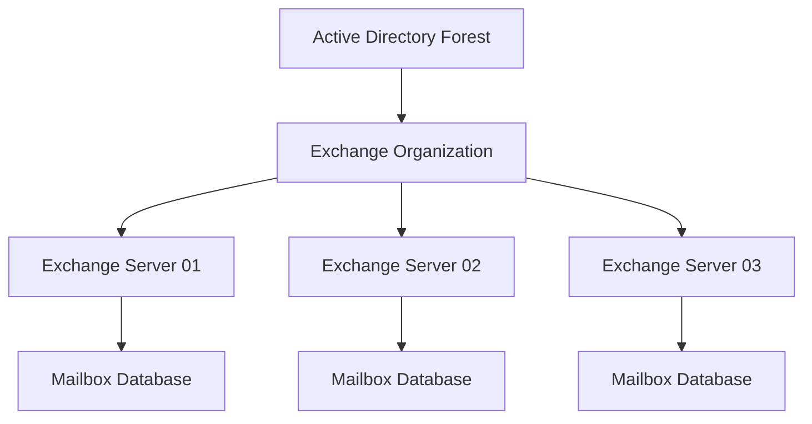

# 02 - Exchange Organization

---

## Document Information

| Property | Value |
|----------|-------|
| Module | Exchange Architecture |
| Category | Core Architecture |
| Difficulty | Beginner / Intermediate |
| Reading Time | 20 Minutes |
| Applies To | Exchange Server 2016, Exchange Server 2019, Exchange Server SE |

---

# Objective

The objective of this document is to explain the Exchange Organization, which is the highest logical container within Microsoft Exchange Server.

Understanding the Exchange Organization helps administrators understand how Exchange stores configuration information and manages messaging across servers.

---

# What is an Exchange Organization?

An Exchange Organization is the logical boundary of an Exchange deployment.

Every Exchange Server installed into the same Active Directory Forest automatically becomes part of the same Exchange Organization.

All Exchange Servers inside the organization share:

- Active Directory Configuration
- Mail Flow Configuration
- Accepted Domains
- Email Address Policies
- Certificates
- Organization Settings
- RBAC Roles

An Exchange Organization is created automatically during the installation of the first Exchange Server.

---

# Exchange Organization Architecture



---

# Components of an Exchange Organization

| Component | Description |
|-----------|-------------|
| Organization | Top-level Exchange configuration |
| Administrative Groups | Logical grouping used internally |
| Servers | Exchange Mailbox Servers |
| Databases | Mailbox Databases |
| Connectors | Send and Receive Connectors |
| Accepted Domains | Domains that Exchange accepts email for |
| RBAC | Role-Based Access Control |
| Transport Rules | Organization-wide mail rules |

---

# Active Directory Integration

Exchange stores most configuration information inside Active Directory.

Examples include:

- Mailboxes
- Distribution Groups
- Accepted Domains
- Email Policies
- RBAC
- Connectors
- Virtual Directories

If Active Directory becomes unavailable, Exchange functionality will be affected.

---

# PowerShell Discovery Commands

## View Organization Configuration

```powershell
Get-OrganizationConfig
```

---

## View Accepted Domains

```powershell
Get-AcceptedDomain
```

---

## View Exchange Servers

```powershell
Get-ExchangeServer
```

---

## View Mailbox Databases

```powershell
Get-MailboxDatabase
```

---

## View Transport Configuration

```powershell
Get-TransportConfig
```

---

# Sample Output

```powershell
Get-ExchangeServer

Name      Edition     AdminDisplayVersion
--------------------------------------------
EXCH01    Enterprise  Version 15.2 (Build 1544.4)
EXCH02    Enterprise  Version 15.2 (Build 1544.4)
```

---

# Explanation

| Property | Description |
|-----------|-------------|
| Name | Exchange Server Name |
| Edition | Standard or Enterprise |
| AdminDisplayVersion | Exchange Version and Build |

---

# Production Scenario

A customer reports that users from one office cannot send email.

Before troubleshooting, verify:

- Exchange Organization Health
- Accepted Domains
- Send Connectors
- Transport Services
- DNS
- Active Directory Replication

Many issues that appear to be server-specific are actually organization-wide configuration problems.

---

# Health Verification Checklist

- Exchange Organization Accessible
- Active Directory Healthy
- Accepted Domains Configured
- Exchange Servers Reachable
- Mailbox Databases Mounted
- Transport Services Running
- Certificates Valid

---

# Common Issues

- Incorrect Accepted Domains
- Missing Send Connector
- Active Directory Replication Failures
- Exchange Server Version Mismatch
- Unsupported CU Level
- DNS Misconfiguration

---

# Best Practices

- Maintain all Exchange Servers at supported CU and SU levels.
- Document organization-wide settings.
- Monitor Active Directory health.
- Review transport configuration regularly.
- Verify organization configuration before implementing changes.

---

# Interview Questions

1. What is an Exchange Organization?
2. How many Exchange Organizations can exist in one Active Directory Forest?
3. Where is Exchange configuration stored?
4. What happens if Active Directory is unavailable?
5. Which PowerShell command displays Exchange Organization settings?

---

# Microsoft Learn References

Recommended reading:

- Exchange Server architecture
- Exchange organization overview
- Accepted Domains
- Transport Configuration

---

# Related Articles

- Exchange Overview
- Active Directory Discovery
- Environment Discovery
- Exchange Discovery

---

# Summary

The Exchange Organization is the central logical container that manages Exchange configuration across the entire deployment.

Understanding the organization structure is essential before working with mail flow, databases, high availability, certificates, and client connectivity.

---

# Next Document

**03-Exchange-Components.md**
