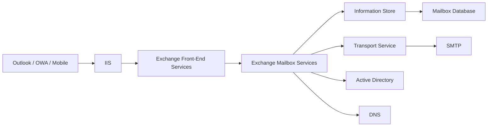

# 03 - Exchange Components

---

## Document Information

| Property | Value |
|----------|-------|
| Module | Exchange Architecture |
| Category | Core Components |
| Difficulty | Intermediate |
| Estimated Reading Time | 25 Minutes |
| Applies To | Exchange Server 2016, Exchange Server 2019, Exchange Server SE |

---

# Objective

The purpose of this document is to explain the major components that make up Microsoft Exchange Server and how they work together to provide messaging services.

A solid understanding of these components helps administrators troubleshoot issues more effectively and understand Exchange architecture at a deeper level.

---

# Overview

Microsoft Exchange Server consists of several integrated components.

Each component performs a specific function but relies on other components to provide complete messaging services.

---

# Exchange Component Architecture



---

# Major Components

| Component | Purpose |
|-----------|---------|
| Active Directory | Stores Exchange configuration and recipient information |
| Mailbox Server | Hosts Exchange services |
| Information Store | Manages mailbox databases |
| Mailbox Database | Stores mailbox data |
| IIS | Provides web services |
| Front-End Transport | Receives SMTP traffic |
| Transport Service | Routes internal and external mail |
| Mailbox Transport Service | Delivers messages to databases |
| DNS | Resolves Exchange services |
| Certificates | Secure communications |

---

# Active Directory

Exchange depends on Active Directory for:

- Mailboxes
- Users
- Groups
- Policies
- Transport Configuration
- RBAC
- Accepted Domains

Without Active Directory, Exchange cannot function correctly.

---

# Internet Information Services (IIS)

Exchange uses IIS to host:

- Outlook on the Web (OWA)
- Exchange Admin Center (EAC)
- Exchange Web Services (EWS)
- ActiveSync
- MAPI over HTTP
- Autodiscover

---

# Information Store Service

Service Name

```
MSExchangeIS
```

Purpose

- Mount mailbox databases
- Read mailbox data
- Write mailbox data
- Manage mailbox connections

If this service stops:

- Databases dismount
- Users lose mailbox access

---

# Mailbox Database

Stores:

- Emails
- Calendars
- Contacts
- Tasks
- Public Folder data (if configured)

Files include:

- EDB
- Transaction Logs
- Checkpoint Files

---

# Front-End Transport Service

Receives SMTP traffic from:

- Internet
- Exchange Servers
- Internal Applications

Service Name

```
MSExchangeFrontEndTransport
```

---

# Transport Service

Responsible for:

- Mail Routing
- Transport Rules
- SMTP Processing
- Message Categorization

Service Name

```
MSExchangeTransport
```

---

# Mailbox Transport Service

Responsible for:

- Delivering messages to mailbox databases
- Retrieving messages from databases

Service Name

```
MSExchangeDelivery
```

---

# Client Access Services

Client protocols include:

- Outlook
- OWA
- ActiveSync
- EWS
- MAPI over HTTP
- POP3
- IMAP

---

# Exchange Services

Useful PowerShell command:

```powershell
Get-Service *Exchange*
```

---

# Exchange Server Discovery

```powershell
Get-ExchangeServer
```

---

# Mailbox Database Discovery

```powershell
Get-MailboxDatabase
```

---

# Certificate Discovery

```powershell
Get-ExchangeCertificate
```

---

# Component Dependency Diagram

```text
User

↓

Outlook

↓

IIS

↓

Exchange Services

↓

Information Store

↓

Mailbox Database

↓

Active Directory

↓

DNS
```

---

# Production Scenario

A user reports:

> Outlook cannot connect.

Possible components to investigate:

- IIS
- Certificates
- DNS
- Active Directory
- Exchange Services
- Information Store
- Mailbox Database

Understanding component relationships significantly reduces troubleshooting time.

---

# Health Verification

Verify:

- Exchange Services Running
- Databases Mounted
- IIS Running
- Active Directory Reachable
- DNS Working
- Certificates Valid
- SMTP Operational

---

# Common Issues

- IIS stopped
- Information Store stopped
- Database dismounted
- Active Directory unavailable
- DNS failure
- Expired certificate
- SMTP transport stopped

---

# Best Practices

- Learn component interactions before troubleshooting.
- Monitor Exchange services.
- Document dependencies.
- Verify service health regularly.
- Maintain updated architecture diagrams.

---

# Interview Questions

1. What are the major Exchange components?
2. What is the Information Store service?
3. Why does Exchange require IIS?
4. What happens if Active Directory becomes unavailable?
5. Which service is responsible for SMTP transport?

---

# Production Notes

Many Exchange incidents involve multiple components.

For example, an Outlook connectivity issue could involve:

- DNS
- IIS
- Certificates
- Active Directory
- Exchange Services

Always investigate the complete dependency chain instead of focusing on a single component.

---

# Microsoft Learn References

Recommended reading:

- Exchange Server Architecture
- Exchange Services
- IIS Integration
- Mailbox Server Role

---

# Summary

Microsoft Exchange Server is composed of multiple integrated components that work together to provide secure, reliable messaging services.

Understanding how these components interact is essential for administration, troubleshooting, migrations, and performance optimization.

---

# Next Document

**04-Mailbox-Server-Role.md**
