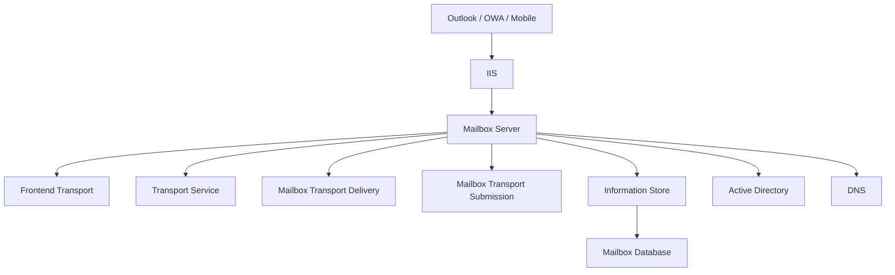

# 04 - Mailbox Server Role

---

## Document Information

| Property | Value |
|----------|-------|
| Module | Exchange Architecture |
| Category | Server Roles |
| Difficulty | Intermediate |
| Estimated Reading Time | 25 Minutes |
| Applies To | Exchange Server 2016, Exchange Server 2019, Exchange Server SE |

---

# Objective

The objective of this document is to explain the Mailbox Server role, its architecture, responsibilities, internal components, and how it processes client requests and mail flow.

---

# Introduction

Beginning with Exchange Server 2016, Microsoft simplified the server architecture by consolidating server roles.

Unlike Exchange 2010 and Exchange 2013, where multiple server roles existed (Mailbox, Client Access, Hub Transport, Unified Messaging, Edge Transport), Exchange 2016 and later primarily use the **Mailbox Server Role**.

This role hosts almost every Exchange service required to process client connections, mail flow, and mailbox operations.

---

# Mailbox Server Architecture



---

# Responsibilities

The Mailbox Server role is responsible for:

- Hosting mailbox databases
- Managing user mailboxes
- Processing SMTP mail
- Client authentication
- Mail routing
- Calendar services
- Public Folder services
- Exchange Web Services
- Outlook connectivity
- High Availability

---

# Major Services

| Service | Description |
|----------|-------------|
| MSExchangeIS | Information Store |
| MSExchangeTransport | Mail Transport |
| MSExchangeFrontEndTransport | Front-End SMTP |
| MSExchangeDelivery | Mailbox Delivery |
| MSExchangeSubmission | Mailbox Submission |
| MSExchangeServiceHost | Background Services |
| W3SVC | IIS Web Services |

---

# Internal Workflow

When a user opens Outlook:

```text
Outlook

↓

DNS

↓

HTTPS

↓

IIS

↓

Authentication

↓

Exchange Services

↓

Information Store

↓

Mailbox Database

↓

Mailbox Opened
```

---

# Inside Exchange

### What happens when Outlook connects?

1. Outlook resolves the Exchange server using DNS.
2. A secure HTTPS connection is established.
3. IIS receives the client request.
4. Authentication is performed using Active Directory.
5. Exchange verifies mailbox permissions.
6. The Information Store accesses the mailbox database.
7. Mailbox contents are returned to Outlook.

This process happens in just a few seconds under normal conditions.

---

# What happens when a user sends an email?

```text
User

↓

Outlook

↓

Mailbox Submission Service

↓

Transport Service

↓

SMTP Routing

↓

Destination Mailbox

↓

Information Store
```

---

# PowerShell Commands

## View Exchange Servers

```powershell
Get-ExchangeServer
```

---

## View Exchange Services

```powershell
Get-Service *Exchange*
```

---

## View Mailbox Databases

```powershell
Get-MailboxDatabase
```

---

## Test Mail Flow

```powershell
Test-Mailflow
```

---

## View Health Status

```powershell
Test-ServiceHealth
```

---

# Sample Output

```powershell
Test-ServiceHealth

Role      RequiredServicesRunning
---------------------------------
Mailbox   True
```

---

# Explanation

If the output displays:

```text
RequiredServicesRunning : True
```

the essential Exchange services are running.

If the value is **False**, one or more required services have stopped and should be investigated.

---

# Production Scenario

### Scenario

Users suddenly report:

> Outlook cannot connect.

Before restarting the server, verify:

- IIS
- Exchange Services
- Database Status
- DNS
- Certificates
- Active Directory
- Windows Event Logs

Many Outlook connectivity issues are caused by service failures rather than database corruption.

---

# Health Checklist

Verify:

- IIS Running
- Exchange Services Running
- Databases Mounted
- Certificates Valid
- DNS Resolution
- Active Directory Reachable
- CPU Healthy
- Memory Healthy
- Disk Space Available

---

# Common Issues

- IIS stopped
- Information Store stopped
- Database dismounted
- Exchange services stopped
- Certificate expired
- Active Directory unavailable
- Low disk space
- High memory utilization

---

# Troubleshooting Workflow

```text
User Issue

↓

Exchange Services

↓

Database

↓

IIS

↓

Certificates

↓

DNS

↓

Active Directory

↓

Resolution
```

---

# Best Practices

- Monitor Exchange services continuously.
- Verify database status daily.
- Keep Exchange on supported CU and SU levels.
- Monitor Windows Event Logs.
- Review certificate expiry monthly.
- Test mail flow after maintenance.

---

# Interview Questions

1. What is the Mailbox Server role?
2. Which services are hosted on the Mailbox Server?
3. What happens internally when Outlook connects?
4. How does Exchange authenticate users?
5. Which PowerShell command verifies Exchange services?

---

# Microsoft Learn References

Recommended reading:

- Exchange Server architecture
- Mailbox server role
- Exchange services
- Test-ServiceHealth cmdlet

---

# Summary

The Mailbox Server role is the heart of modern Microsoft Exchange Server.

It hosts the core services responsible for mailbox access, mail transport, client connectivity, authentication, and high availability.

Understanding this role is essential for Exchange administration, troubleshooting, and architecture design.

---

# Next Document

**05-Exchange-Services.md**
