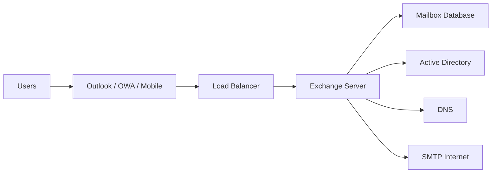

# 01 - Exchange Overview

---

## Document Information

| Item | Value |
|------|-------|
| Module | Exchange Architecture |
| Difficulty | Beginner to Intermediate |
| Estimated Reading Time | 15 Minutes |
| Applies To | Exchange Server 2016, 2019, Subscription Edition (SE) |

---

# Objective

The purpose of this document is to provide a high-level understanding of Microsoft Exchange Server, its architecture, core components, and how it integrates with Active Directory to deliver enterprise email services.

This document serves as the foundation for all subsequent Exchange architecture topics.

---

# What is Microsoft Exchange Server?

Microsoft Exchange Server is an enterprise messaging and collaboration platform developed by Microsoft.

It provides secure email communication, calendaring, contacts, task management, and collaboration services for organizations.

Exchange integrates tightly with Active Directory and uses Windows Server technologies to deliver highly available messaging services.

---

# Core Features

Microsoft Exchange provides:

- Enterprise Email
- Shared Calendars
- Contacts
- Tasks
- Meeting Scheduling
- Mail Flow Management
- Security & Compliance
- High Availability
- Disaster Recovery
- Hybrid Integration with Microsoft 365

---

# Exchange Architecture Overview



---

# Major Components

| Component | Purpose |
|-----------|---------|
| Active Directory | Stores Exchange configuration and recipient information |
| Exchange Server | Hosts Exchange services |
| Mailbox Database | Stores mailbox data |
| IIS | Provides web-based services such as OWA and ECP |
| SMTP | Handles mail transport |
| DNS | Resolves Exchange services |
| Certificates | Secure client communications |

---

# Exchange Services

Important Exchange services include:

- Microsoft Exchange Information Store
- Microsoft Exchange Transport
- Microsoft Exchange Frontend Transport
- Microsoft Exchange Mailbox Assistants
- Microsoft Exchange Service Host
- Microsoft Exchange RPC Client Access

These services work together to provide messaging functionality.

---

# Exchange Clients

Users can connect using:

- Microsoft Outlook
- Outlook on the Web (OWA)
- Mobile Devices (ActiveSync)
- Exchange Web Services (EWS)
- MAPI over HTTP
- POP3 / IMAP (if enabled)

---

# Exchange Versions

| Version | Status |
|----------|--------|
| Exchange Server 2016 | Supported (depending on lifecycle) |
| Exchange Server 2019 | Current Enterprise Version |
| Exchange Server Subscription Edition (SE) | Latest Subscription Model |

Always verify Microsoft's current lifecycle policy before planning upgrades or deployments.

---

# Exchange Dependencies

Exchange relies on:

- Active Directory
- DNS
- IIS
- Windows Server
- Certificates
- .NET Runtime (version depends on the Exchange release)
- PowerShell

If any dependency is unhealthy, Exchange functionality may be affected.

---

# Typical Mail Flow

```text
Sender
    │
    ▼
SMTP
    │
    ▼
Exchange Transport Service
    │
    ▼
Mailbox Database
    │
    ▼
Recipient
```

---

# Typical Administrator Responsibilities

Exchange Administrators perform tasks such as:

- User Mailbox Administration
- Mail Flow Configuration
- Database Management
- Certificate Management
- Backup Verification
- Health Checks
- Performance Monitoring
- Troubleshooting
- Security Updates
- Disaster Recovery

---

# Production Scenario

**Scenario**

A user reports that Outlook cannot connect.

Before restarting services or making configuration changes, an administrator should verify:

- Exchange server availability
- Active Directory health
- DNS resolution
- Exchange services
- Certificate validity
- Client connectivity
- Mailbox database status

This systematic approach helps identify the root cause efficiently.

---

# Basic Verification Commands

### Exchange Version

```powershell
Get-ExchangeServer
```

### Exchange Services

```powershell
Get-Service *Exchange*
```

### Mailbox Databases

```powershell
Get-MailboxDatabase
```

### Mail Flow

```powershell
Test-Mailflow
```

### Queue Status

```powershell
Get-Queue
```

---

# Best Practices

- Understand the Exchange architecture before making configuration changes.
- Keep Exchange updated with supported Cumulative Updates (CU) and Security Updates (SU).
- Monitor server health regularly.
- Maintain accurate documentation.
- Validate changes in a test environment whenever possible.

---

# Common Mistakes

- Troubleshooting without understanding the architecture.
- Ignoring Active Directory or DNS health.
- Delaying certificate renewal.
- Not documenting infrastructure changes.
- Running unsupported Exchange versions.

---

# Interview Questions

1. What is Microsoft Exchange Server?
2. What are the major components of Exchange architecture?
3. Why is Active Directory required for Exchange?
4. Which services are critical for Exchange?
5. What are the common Exchange client connectivity methods?

---

# Related Documents

- Exchange Architecture README
- System Study Module
- Active Directory Discovery
- Server Inventory
- Health Assessment

---

# Summary

Microsoft Exchange Server is an enterprise messaging platform that integrates with Active Directory, Windows Server, DNS, IIS, and certificates to provide secure email and collaboration services.

A solid understanding of Exchange architecture is essential for administration, troubleshooting, migrations, and operational support.

---

# Next Document

**02-Exchange-Organization.md**
